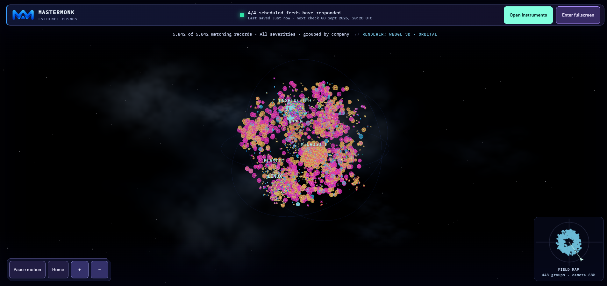

# MasterMonk

**Open-source vulnerability intelligence for discovering, comparing, investigating, and teaching from public evidence.**

**Current version: 3.2.0 · Python 3.11+ · Windows, macOS, Linux, Android, iPhone, and iPad**

[Download the complete project](https://github.com/GurukiranShiv/MasterMonk/archive/refs/heads/main.zip) · [Operations](docs/OPERATIONS.md) · [Security](SECURITY.md) · [Contributing](CONTRIBUTING.md)

MasterMonk starts as an empty, local-first application and builds its catalog from configured public sources. It combines a full-screen 3D evidence universe with conventional search, source-aware record investigation, exact-version component comparison, change intelligence, shareable highlights, and a guided learning lab.

The interface does not ship with simulated vulnerabilities, preset accounts, or a decorative “live attack” feed. Counts, records, source states, and timestamps come from the running instance. Space, cloud, glow, orbit, and flight effects are navigation and evidence encodings—not attack or geographic telemetry.

## What is new in 3.2.0

- **Component vs. component comparison:** query two exact package versions against the current OSV service and separate advisories into component A only, both components, and component B only.
- **Public evidence badges:** generate an SVG badge plus ready-to-copy HTML and Markdown for each exact-version query. An empty response is shown as “0 OSV matches,” never as “safe.”
- **Neutral SARIF output:** scanner exports no longer contain a hardcoded personal repository URL.
- **Pure logic tests:** fast isolated tests cover priority mathematics, CAPEC parsing primitives, badge wording, dependency parsing, and SARIF metadata in addition to the end-to-end verification suite.
- **Evidence Cosmos improvements:** fullscreen rendering, deep-space background, camera flight into a selected record, arrival trails for newly indexed records, mini-map orientation, mobile arrow controls, and grouping by company, weakness, severity, or collected source.
- **Investigation and learning:** a focused evidence drawer, detailed record workspace, CWE → CAPEC → ATT&CK learning where MITRE publishes mappings, and a single-screen investigation lab.
- **Change intelligence:** provider-reported publication timelines, local observation history, explicit UTC date comparison, and drill-down into the records behind each count.
- **Cross-platform install:** the same responsive Progressive Web App can be installed from a reachable HTTPS MasterMonk server on mobile or desktop.

## See MasterMonk in action

These are captures from a running MasterMonk 3.2.0 instance on 8 September 2026. Catalog totals are evidence from that captured instance and will change as providers and local collection history change. [Screenshot provenance](docs/screenshots/mastermonk-3.2/SOURCES.md).

### Fly from the universe into one real record

Touch or click a vulnerability system to start a short camera flight. MasterMonk moves through the depth-layered field, focuses the selected evidence system, and opens the investigation drawer after arrival.

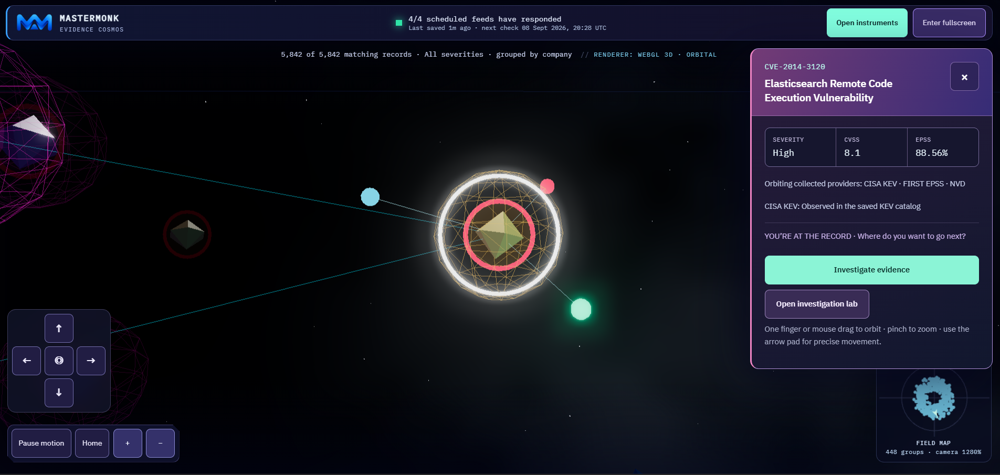

### Discover and prioritize collected evidence

| Discover new disclosures and KEV additions | Search and sort the intelligence catalog |
| --- | --- |
| 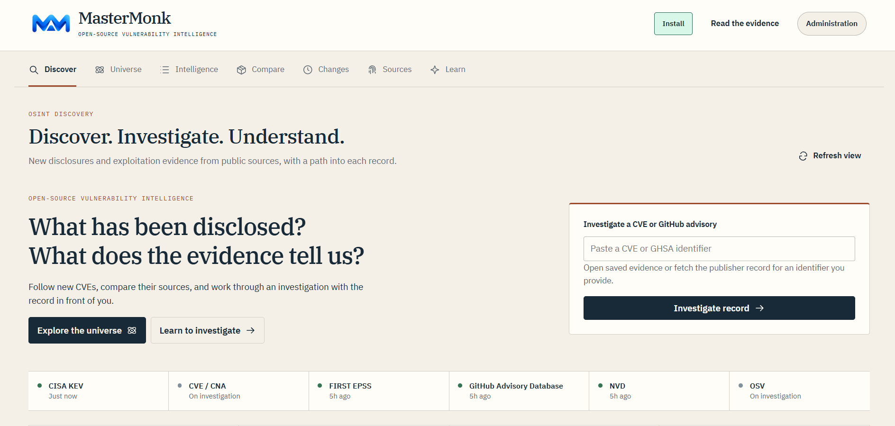 | 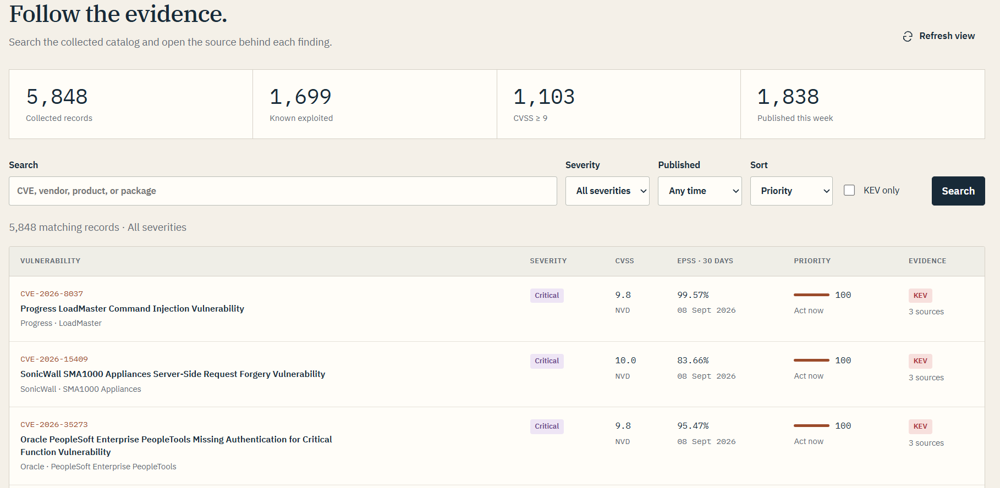 |

### Compare exact component versions

The Compare workspace performs two current OSV exact-version queries. It reports absence as absence, not safety, and creates an independently refreshed public SVG badge for either component.

| Compare two components | Copy public evidence badges |
| --- | --- |
| 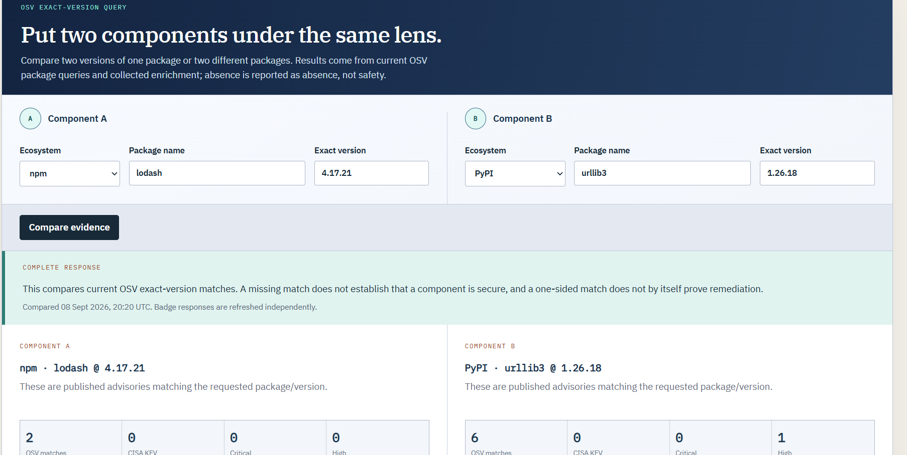 | 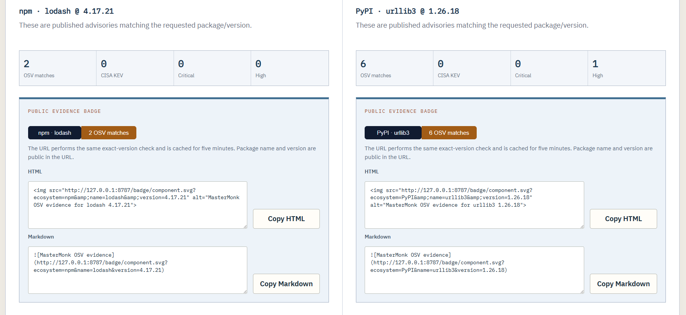 |

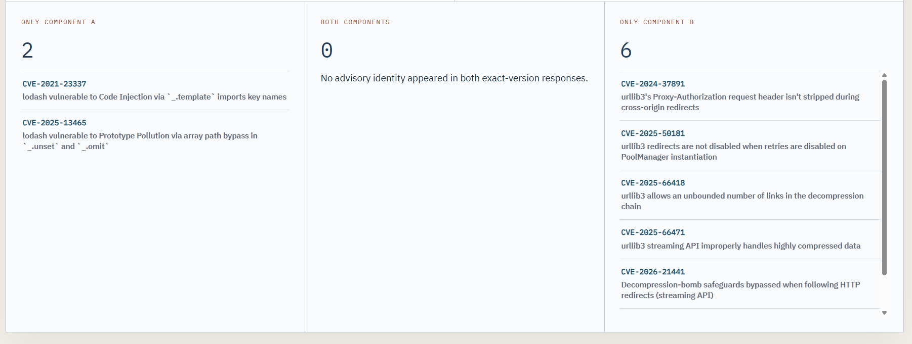

### Open the evidence and learn with the same record

| Source-aware record investigation | Guided investigation lab |
| --- | --- |
| 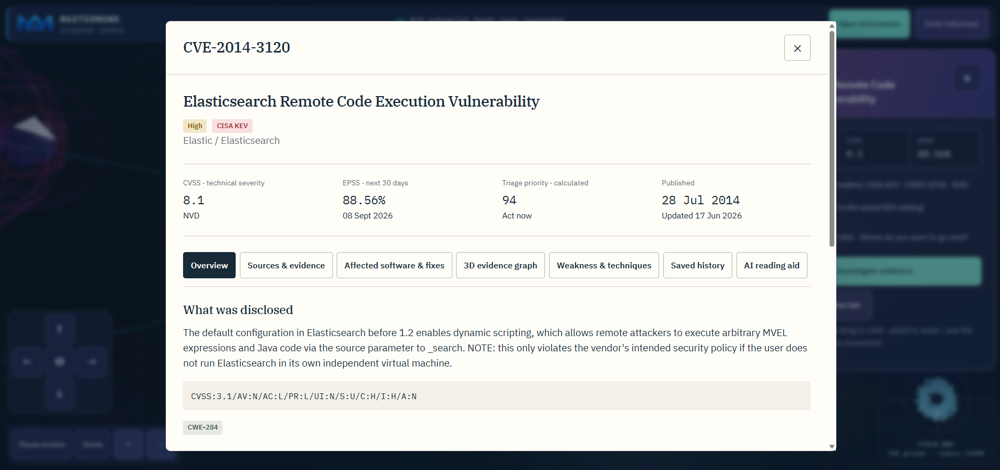 | 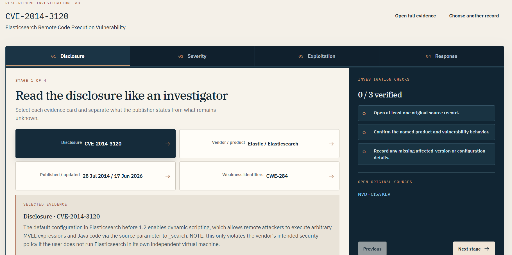 |

### See what changed—and open the records behind it

| Provider publication timeline | Saved evidence change stream |
| --- | --- |
| 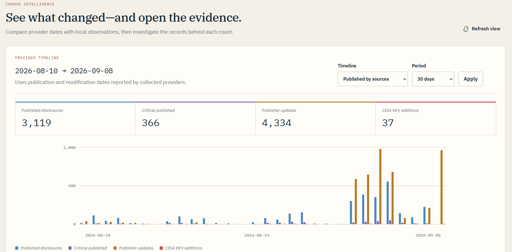 | 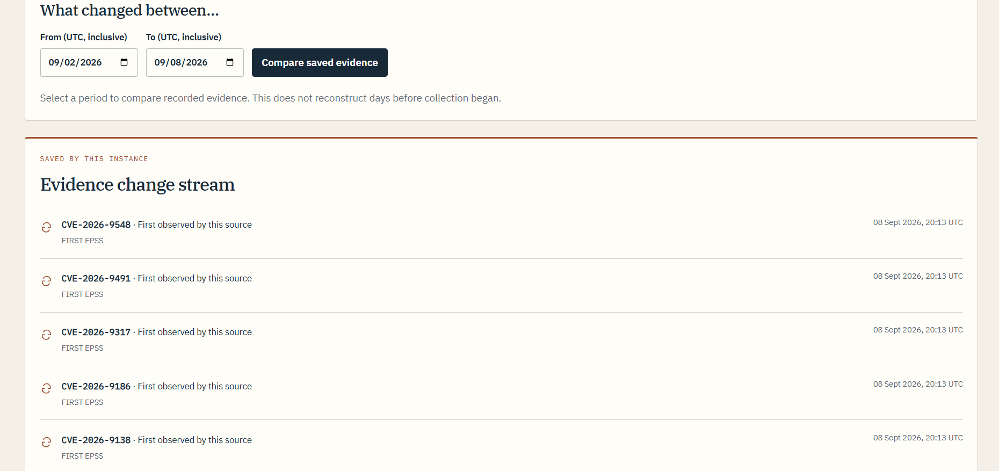 |

<details>
<summary><strong>More 3.2.0 interface captures</strong></summary>

#### Discover: live catalog cards and source health

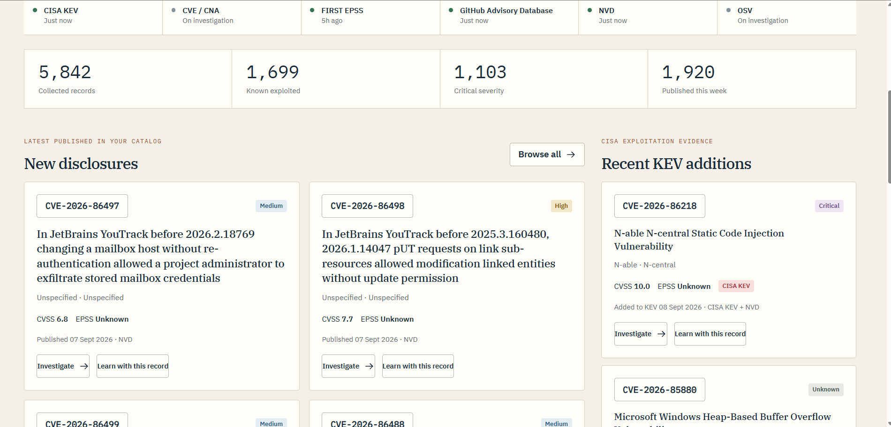

#### Continue from the evidence record into Learn or publisher details

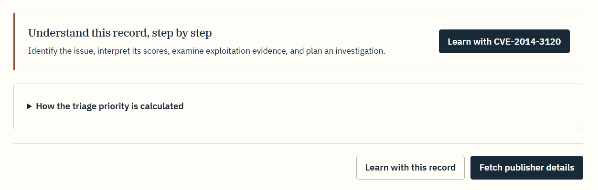

</details>

## Start locally

1. Download and extract the complete project into a new folder.
2. Stop any older MasterMonk process that is already using port `8787`.
3. Start the application:
   - **Windows:** double-click `START_WINDOWS.bat`.
   - **macOS:** open `START_MACOS.command`, or run `sh START.sh` in Terminal.
   - **Linux:** run `sh START.sh`.
4. Open [http://127.0.0.1:8787](http://127.0.0.1:8787).
5. Keep the terminal open while using MasterMonk. Discover is public by default; administration is optional.

Graphics, fonts, Three.js, and the Waitress web server are bundled. A normal local run does not require npm or pip. If port `8787` is occupied, stop the other copy or run `python start.py --port 8788`. If an old interface remains cached, reload once with `Ctrl+F5`.

### Install on Android, iPhone, iPad, or desktop

The installed app is a client for the same running MasterMonk server; it is not a separate database. Make the server reachable through an HTTPS address, open that address on the device, then:

- **Android / Chrome:** choose **Install app**, or use MasterMonk’s **Install** button.
- **iPhone or iPad / Safari:** choose **Share → Add to Home Screen**.
- **Desktop Chrome or Edge:** use the install icon or MasterMonk’s **Install** button.

The service worker caches only the application shell and bundled graphics. API responses, vulnerability records, sessions, feeds, and private workspaces are not cached. Offline, MasterMonk reports that its server is unavailable instead of presenting an old catalog as current.

## Product map

| View | What it does |
| --- | --- |
| **Discover** | Shows the newest collected disclosures, recent CISA KEV additions, provider state, and direct CVE or GHSA lookup. |
| **Universe** | Maps real collected records into a full-screen 3D evidence field. Core shape/color represents severity, size represents CVSS, corona represents EPSS, red orbit marks KEV, and satellites identify collected providers. |
| **Intelligence** | Searches and sorts the catalog by priority, severity, publication period, KEV status, score, and source coverage. |
| **Compare** | Compares two exact ecosystem/package/version identities with current OSV evidence and generates public SVG badges. |
| **Changes** | Contrasts provider dates with local observations, compares two UTC dates, and opens the records behind changed counts. |
| **Sources** | Reports real provider status, last response, collected coverage, daily EPSS updates, and optional historical-import progress. |
| **Learn** | Turns the selected record into a four-stage investigation covering disclosure, severity, exploitation evidence, and response. |
| **Highlights** | Lets signed-in users curate up to 24 collected records and notes into a revocable shareable briefing. |

Each record can expose **Overview**, **Sources & evidence**, **Affected software & fixes**, **3D evidence graph**, **Weakness & techniques**, **Saved history**, and an optional **AI reading aid**.

## Evidence rules

- The catalog begins empty and imports provider responses; no saved catalog is included in the source archive.
- CISA KEV is collected as a complete catalog. NVD and GitHub Advisories use incremental recent windows; older NVD history is an optional resumable import.
- FIRST’s daily EPSS snapshot enriches matching tracked CVEs.
- Publisher detail fetches use CVE/CNA and available OSV advisory evidence for the selected identifier.
- Unknown, missing, incomplete, or unavailable evidence remains labelled that way.
- Newly indexed means first saved by this MasterMonk instance; it does not necessarily mean newly disclosed.
- Priority is a calculated triage aid, not a source claim and not proof that a system is affected.
- CWE → CAPEC → ATT&CK paths are published class-level associations, not proof of how a particular vulnerability was exploited.
- Remediation-field changes are evidence changes, not proof that a user’s system was patched.

The browser checks for saved catalog revisions every 15 seconds, and the embedded collector starts a bounded public-source pass every 15 minutes by default. Provider schedules, rate limits, failures, and response time determine when evidence arrives. MasterMonk is continuously refreshed while running; it does not claim instantaneous streaming.

## Universe controls and encodings

The Universe owns the browser viewport. **Open instruments** slides in search, severity, KEV, grouping, graphics quality, the legend, and routes back to the other workspaces. **Home** restores the overview, **Pause motion** stops ambient movement, the mini-map shows camera orientation, and the arrow pad provides precise movement on touch screens.

Rendering modes deliberately differ:

- **3D · Survey:** quiet wide view, lowest cost, no EPSS halos.
- **3D · Orbital:** EPSS coronas at or above 5%, moderate glow, and light clouds.
- **3D · Deep field:** denser clouds, stronger bloom, and every available EPSS corona.
- **Canvas · 2D fallback:** retains access to the real catalog when WebGL2 is unavailable.

Arrange systems by **company**, **weakness type (CWE)**, **severity**, or **collected source**. The display is bounded at 10,000 records for browser performance; Intelligence pages through the complete local catalog.

## Component evidence and public badges

Compare accepts supported OSV ecosystems, package names, and exact versions. It separates advisory identities into component A only, both components, and component B only. A one-sided match can reflect version applicability, different packages, aliases, pagination, or upstream coverage; it does not by itself prove remediation or relative safety.

Badge URLs contain the public ecosystem, package name, and exact version. They use the same OSV query path as Compare, cache the current result for five minutes, and show explicit unavailable or incomplete states. Do not place confidential component identities in a public badge URL.

## Optional administration and AI

Public browsing and learning do not require an account. Administration provides saved watches, private package checks, highlights, collection controls, and account settings. Create the first administrator only with the expiring setup code printed by the local server.

AI is off until an operator configures a chat-completions-compatible endpoint and model. AI text is labelled **AI-written**, kept separate from collected evidence, and includes source links from the record. No model or paid service is bundled, and MasterMonk does not substitute invented text if generation fails. See [AI configuration](docs/OPERATIONS.md#optional-ai-reading-aid).

## Command-line use

```bash
# Start the local web application
python mastermonk.py serve

# Collect from configured public sources
python mastermonk.py sync --sources cisa,github,nvd,epss

# Scan a dependency manifest and write neutral SARIF
python mastermonk.py scan requirements.txt --format sarif --output mastermonk.sarif

# Build a public static catalog snapshot
python mastermonk.py export-site --data-dir .catalog-data --output _site --base-url https://example.invalid
```

Configuration, Docker, reverse-proxy guidance, source behavior, highlights, AI setup, and upgrade instructions are in [docs/OPERATIONS.md](docs/OPERATIONS.md).

## Verification

```bash
python -E -m unittest discover -s tests -v
python -E tools/verify.py
```

The isolated suite exercises priority mathematics, CAPEC parsing primitives, dependency parsing, badge wording, and SARIF metadata. The full verifier checks Python syntax, JavaScript syntax and Three.js exports, vendored-asset integrity, PWA files, source packaging, empty startup, authentication boundaries, key API routes, and a fresh extracted download. An opt-in live run checks the project’s actual dependency manifest against current CISA and OSV services:

```bash
python -E tools/verify.py --live
```

Live-source results are observations from the time of the run and are not embedded in the project.

## Security, privacy, and licensing

MasterMonk binds to `127.0.0.1` by default. Expose it only through a deployment you control with HTTPS, persistent storage, trusted proxy settings, and a strong administrator password. Runtime databases, imported manifests, source payloads, accounts, sessions, API keys, and `.env` files are excluded from the public source package.

Read [SECURITY.md](SECURITY.md) before a shared deployment. MasterMonk is [MIT licensed](LICENSE); provider data and bundled dependencies retain their own attribution and terms in [THIRD_PARTY_NOTICES.md](THIRD_PARTY_NOTICES.md).
