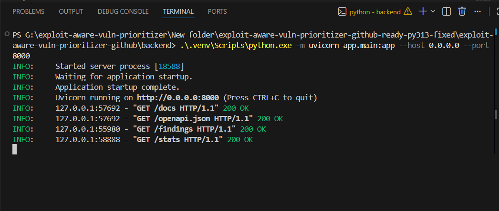
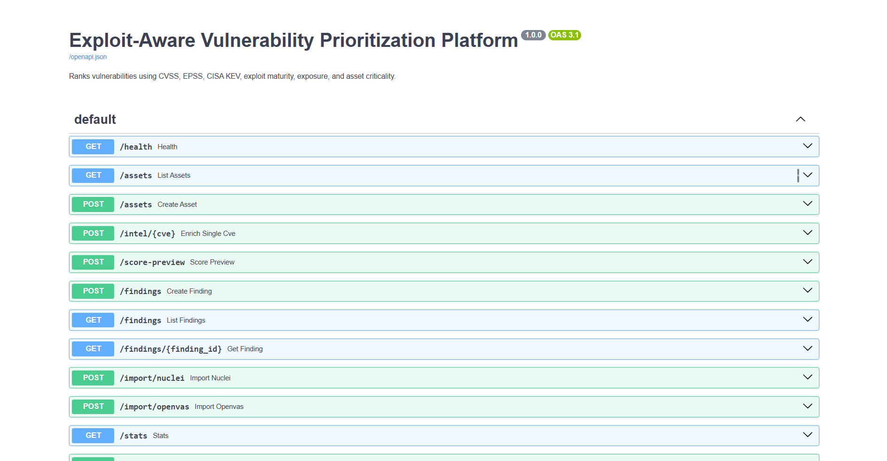
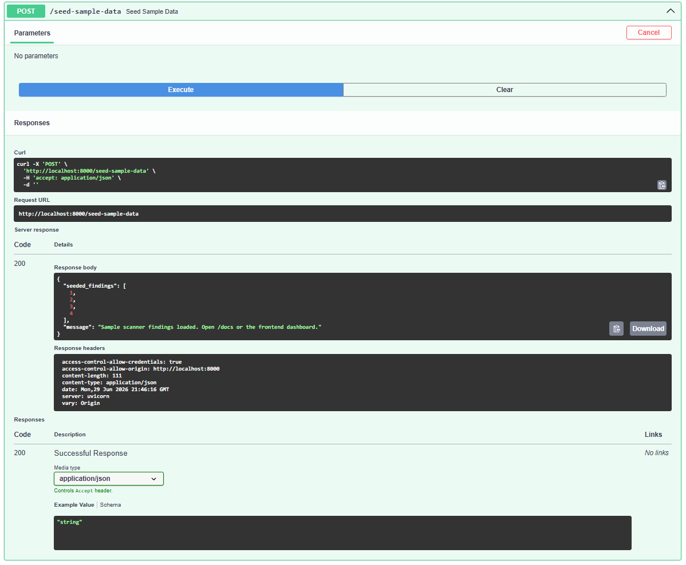
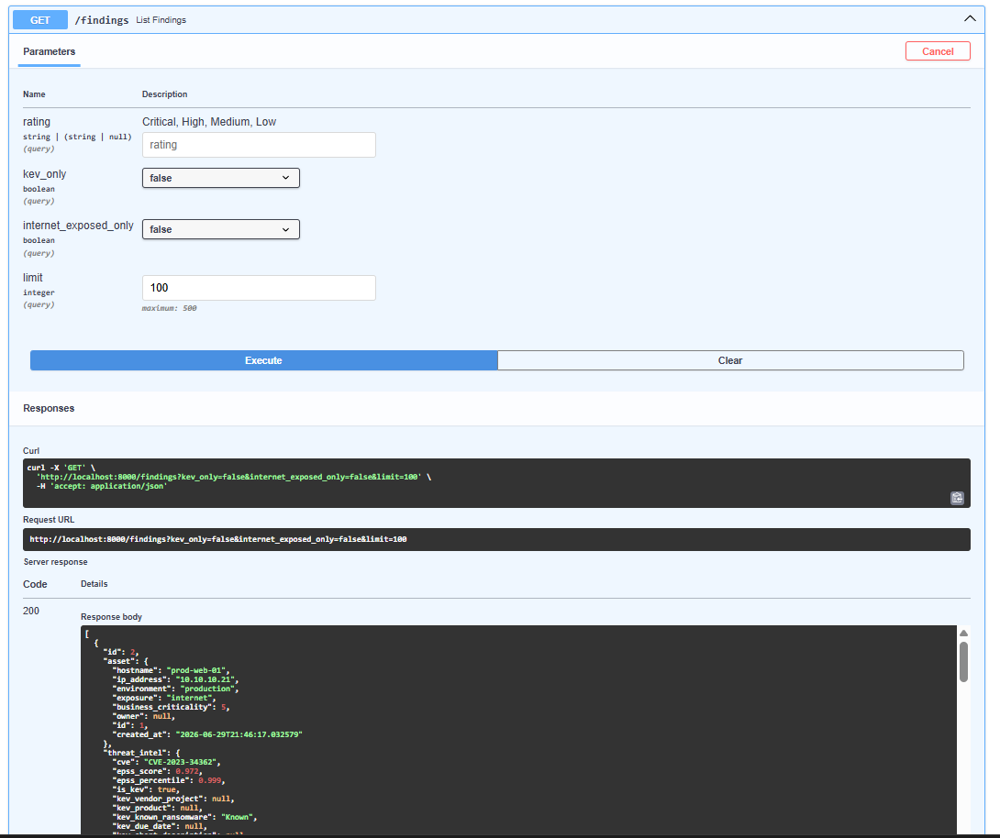
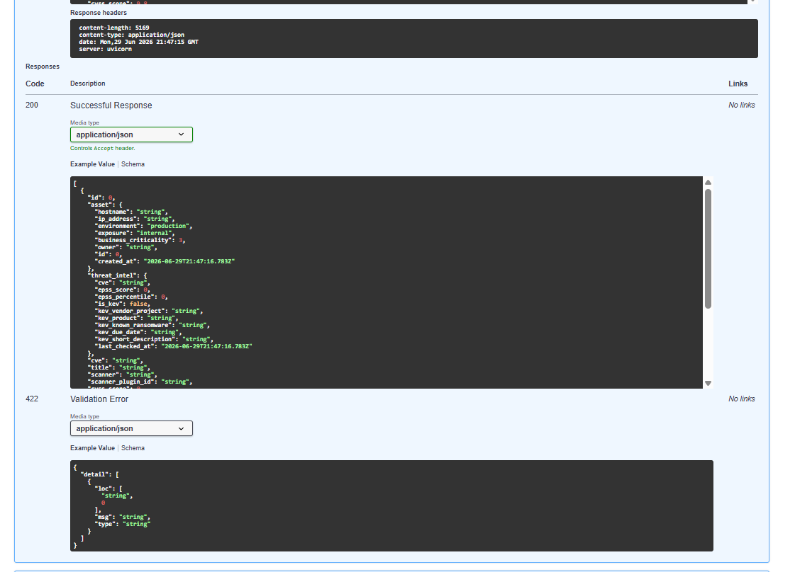
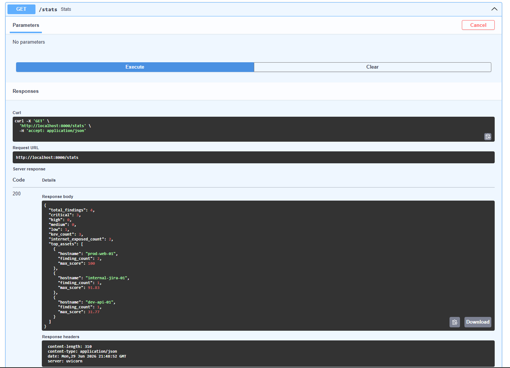
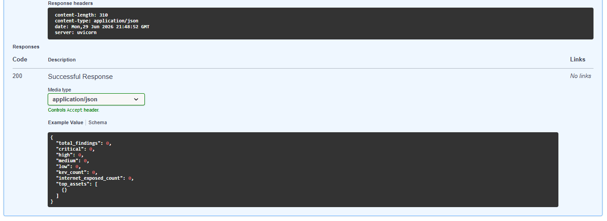
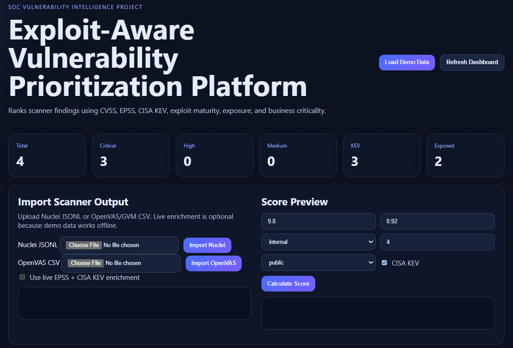
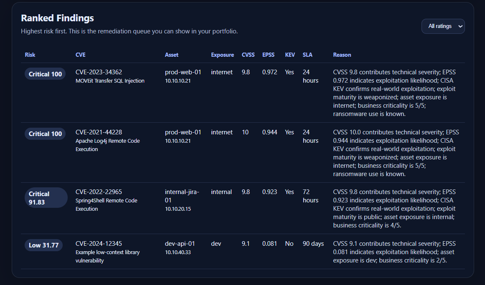
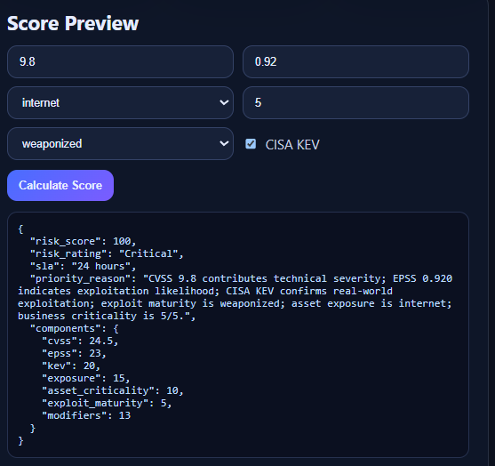

# Exploit-Aware Vulnerability Prioritization Platform

A SOC-focused vulnerability-management project that ranks scanner findings using **CVSS + EPSS + CISA KEV + exploit maturity + asset exposure + business criticality**.

This project goes beyond normal vulnerability scanning. Instead of prioritizing only by CVSS, it ranks vulnerabilities based on real-world exploitation likelihood, known exploitation, asset exposure, and business impact.

---

## Features

- FastAPI backend with Swagger API documentation
- SQLite for local execution
- PostgreSQL support through Docker Compose
- Asset inventory with exposure and business criticality
- Scanner finding ingestion from:
  - Nuclei JSONL
  - OpenVAS / GVM CSV
- Threat-intelligence enrichment from:
  - FIRST EPSS public API
  - CISA Known Exploited Vulnerabilities catalog
- Explainable risk scoring model
- Remediation SLA recommendation
- Frontend dashboard for SOC-style visibility
- Sample scanner findings for portfolio and interview walkthroughs

---

## Project Screenshots / Proof of Execution

### 1. Backend Running Successfully



---

### 2. FastAPI Swagger API



---

### 3. Sample Scanner Findings Loaded



---

### 4. Ranked Findings API Output





---

### 5. Dashboard Statistics API





---

### 6. Frontend Dashboard Overview



---

### 7. Ranked Remediation Queue



---

### 8. Score Preview



---

## Project Structure

```text
exploit-aware-vuln-prioritizer/
├── assets/
│   ├── 01-backend-running.png.png
│   ├── 02-fastapi-swagger.png
│   ├── 03-sample-data-loaded.png
│   ├── 04-ranked-findings-api1.png
│   ├── 04-ranked-findings-api2.png
│   ├── 05-stats-api1.png
│   ├── 05-stats-api2.png
│   ├── 06-dashboard-overview.png
│   ├── 07-ranked-findings-table.png
│   └── 08-score-preview.png
├── backend/
│   ├── app/
│   │   ├── main.py
│   │   ├── models.py
│   │   ├── schemas.py
│   │   ├── scoring.py
│   │   ├── enrichment.py
│   │   ├── importers.py
│   │   └── database.py
│   ├── requirements.txt
│   └── Dockerfile
├── frontend/
│   ├── index.html
│   ├── styles.css
│   └── app.js
├── data/
│   ├── sample_nuclei.jsonl
│   └── sample_openvas.csv
├── docs/
│   ├── architecture.md
│   └── interview_explanation.md
├── scripts/
│   ├── run_local.ps1
│   └── run_local.sh
├── tests/
│   └── test_scoring.py
├── docker-compose.yml
├── .env.example
├── .gitignore
└── README.md
```

---

## How the Project Works

The platform takes vulnerability findings from scanner outputs or manual API input, enriches the CVEs with external threat intelligence, calculates an explainable risk score, and produces a ranked remediation queue.

```text
Scanner Output / Manual Finding
        ↓
Normalize CVE and Asset Data
        ↓
Enrich with EPSS + CISA KEV
        ↓
Calculate Exploit-Aware Risk Score
        ↓
Assign Severity and Remediation SLA
        ↓
Display Ranked Findings in API and Dashboard
```

---

## Input Sources

### 1. Nuclei JSONL

The platform can import Nuclei JSONL output through:

```text
POST /import/nuclei
```

Sample file included:

```text
data/sample_nuclei.jsonl
```

---

### 2. OpenVAS / GVM CSV

The platform can import OpenVAS/GVM CSV reports through:

```text
POST /import/openvas
```

Sample file included:

```text
data/sample_openvas.csv
```

---

### 3. Manual Finding Creation

Analysts can manually create a finding through:

```text
POST /findings
```

---

### 4. EPSS Enrichment

The platform uses EPSS to estimate the probability that a vulnerability may be exploited in the wild.

---

### 5. CISA KEV Enrichment

The platform checks whether a CVE is listed in the CISA Known Exploited Vulnerabilities catalog.

---

### 6. Asset Context

The platform considers asset details such as:

- Asset name
- IP address
- Environment
- Exposure level
- Business criticality
- Owner

---

## Risk Scoring Model

The scoring model is explainable and uses multiple real-world prioritization signals.

| Signal | Weight | Meaning |
|---|---:|---|
| CVSS | 25% | Technical vulnerability severity |
| EPSS | 25% | Exploitation probability |
| CISA KEV | 20% | Confirmed real-world exploitation |
| Asset Exposure | 15% | Internet-facing, DMZ, internal, or dev |
| Asset Criticality | 10% | Business importance of the affected asset |
| Exploit Maturity | 5% | None, PoC, public exploit, or weaponized exploit |

Additional modifiers are applied for:

- Known ransomware usage
- KEV vulnerabilities on exposed assets
- Very high EPSS with high CVSS

---

## Why This Project Is Useful

A normal vulnerability scanner may report:

```text
CVE A = CVSS 9.8
CVE B = CVSS 9.1
```

But real SOC and vulnerability-management teams need more context:

```text
CVE A is internet-facing, listed in CISA KEV, has high EPSS, and has weaponized exploit activity: fix immediately.

CVE B has high CVSS, but low EPSS, no KEV listing, no exploit maturity, and affects a dev-only asset: schedule normally.
```

This project demonstrates the difference between **vulnerability detection** and **vulnerability prioritization**.

---

## Run Locally Without Docker

### Backend

Open PowerShell from the project root:

```powershell
cd exploit-aware-vuln-prioritizer
copy .env.example backend\.env
Set-ExecutionPolicy -Scope Process -ExecutionPolicy Bypass
.\scripts\run_local.ps1
```

Open:

```text
http://localhost:8000/docs
```

Load sample scanner findings:

```text
POST /seed-sample-data
```

---

### Frontend

Open a new PowerShell window:

```powershell
cd frontend
py -m http.server 8080
```

Open:

```text
http://localhost:8080
```

Click:

```text
Load Sample Scanner Findings
```

---

## Run With Docker Compose

```bash
docker compose up --build
```

Open:

```text
Backend API: http://localhost:8000/docs
Frontend:    http://localhost:8080
```

---

## API Endpoints

| Method | Endpoint | Purpose |
|---|---|---|
| GET | `/health` | Health check |
| POST | `/assets` | Create asset |
| GET | `/assets` | List assets |
| POST | `/intel/{cve}` | Enrich one CVE with EPSS and KEV |
| POST | `/findings` | Create manual finding |
| GET | `/findings` | List ranked findings |
| GET | `/findings/{id}` | View finding details |
| POST | `/import/nuclei` | Import Nuclei JSONL |
| POST | `/import/openvas` | Import OpenVAS CSV |
| POST | `/score-preview` | Test scoring logic |
| GET | `/stats` | Dashboard metrics |
| POST | `/seed-sample-data` | Load sample scanner findings |

---

## Example Walkthrough

1. Start the backend.
2. Open `http://localhost:8000/docs`.
3. Run `POST /seed-sample-data`.
4. Run `GET /findings`.
5. Open frontend at `http://localhost:8080`.
6. Review ranked findings, severity, SLA, and reasoning.
7. Use score preview to test custom scoring scenarios.

---

## Security Notes

- This project does not exploit systems.
- This project does not contain offensive exploit code.
- It is designed for authorized vulnerability-management workflows.
- Scanner imports should only come from systems you own or are authorized to assess.

---

## Windows / Python Note

For local Windows execution, this project uses plain `uvicorn` instead of `uvicorn[standard]` to avoid native build dependency issues such as `httptools` and `watchfiles`.

If your system defaults to Python 3.13 free-threaded, use Python 3.12 for local execution:

```powershell
py -3.12 -m venv .venv
```

---

## Resume Explanation

**Exploit-Aware Vulnerability Prioritization Platform**

Built a FastAPI-based vulnerability prioritization platform that ingests OpenVAS and Nuclei scanner outputs, enriches CVEs with EPSS and CISA KEV intelligence, and calculates an explainable remediation priority score using CVSS, exploit maturity, asset exposure, and business criticality. Developed a dashboard and API to rank findings, assign remediation SLAs, and reduce CVSS-only prioritization noise.

---

## Future Improvements

- Authentication and role-based access control
- Scheduled background enrichment
- Jira / ServiceNow ticket creation
- Slack alerting for newly added KEV vulnerabilities
- CMDB integration
- Historical trend charts
- SLA breach tracking
- Container image scanner import support
- SBOM import support
