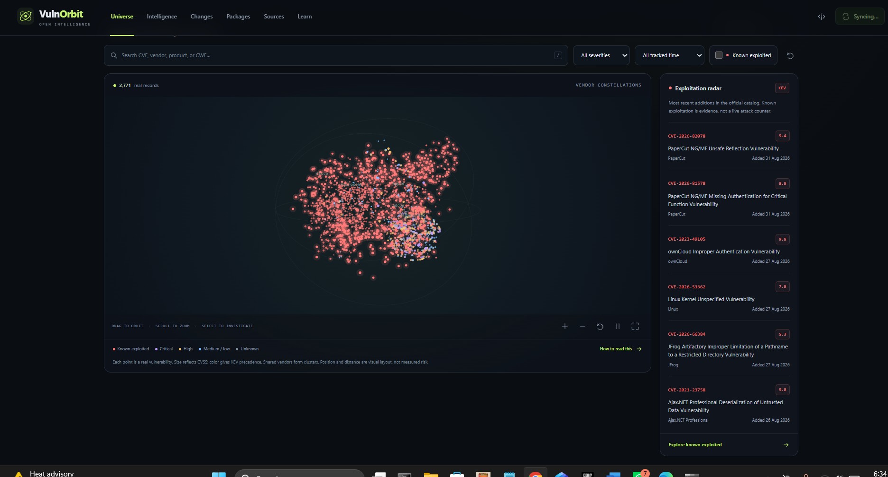
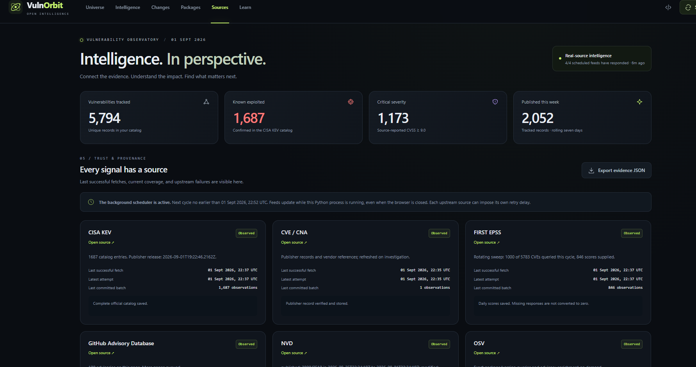
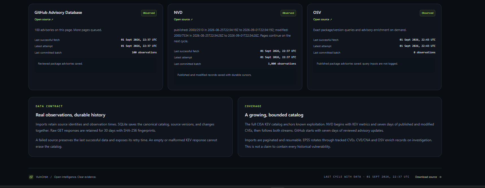
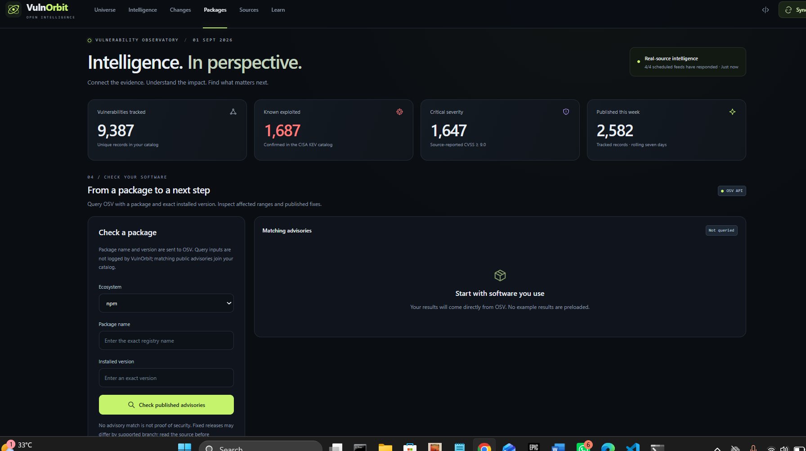

*These are real frontend captures from the earlier dark-theme build. The current Atlas interface uses ivory information pages, an ink-blue universe, copper accents, and IBM Plex fonts; the captures are not screenshots of the new theme.*

# XploitAtlas

**Helping you understand vulnerabilities, why they matter, and what to prioritize.**

The Atlas interface includes a compact source register, readable locally bundled typography, responsive layouts, and bounded icons. The real-source data pipeline and Canvas visualization are retained.

Explore published vulnerabilities in an animated, interactive 3D universe. Connect severity, exploitation evidence, package advisories, source updates, and remediation information to understand what changed and what deserves attention.

[Start here](RUN_ME_FIRST.md) · [Technical guide](docs/TECHNICAL_GUIDE.md) · [Security boundaries](SECURITY.md) · [MIT license](LICENSE)

This repository contains the complete runnable application. Select **Code → Download ZIP**, extract the whole archive into a **new folder**, and open the folder containing **START_WINDOWS.bat** and **start.py**. No separate launcher download or files from another branch are needed.

Previously named VulnOrbit. Existing `VULNORBIT_*` configuration settings, database names, and API compatibility identifiers are retained. The original MIT attribution is preserved. Downloading this project does not modify another installation's saved data.

## 01 / The 3D vulnerability universe

The opening screenshot shows the running application: imported records form vendor constellations, with a known-exploitation radar alongside the universe. Drag to orbit, zoom, filter by severity or KEV status, and select a record to investigate its evidence.

The universe is animated inside the app. It projects a 3D layout onto a **2D Canvas**, not WebGL or Three.js. The README contains static captures, not an embedded interactive viewer.

## 02 / Catalog overview and source health

See the state of the imported catalog at a glance: tracked vulnerabilities, known-exploited records, critical severity, and recent publications. The Sources register exposes successful fetches, observation counts, and the next scheduled update so freshness and coverage stay visible.

## 03 / Coverage and provenance

Check which feeds supplied evidence, when they responded, and where imports are still catching up. Published source records, observation history, and resumable imports make the catalog's coverage and remaining import progress explicit.

## 04 / Package advisory lookup

Query a package by ecosystem, exact registry name, and installed version. Matching public advisories come from OSV, with affected ranges and published fixed versions where the source supplies them.

*This capture shows the form before submission, not a package finding. Results are retrieved when a query is submitted; no example findings are preloaded.*

All four images are actual frontend captures supplied from a local run on 1 September 2026, before the rename to XploitAtlas; they retain the former VulnOrbit branding. Counts and timestamps are snapshots from different moments during ingestion, not live figures or benchmark claims. [Screenshot provenance](docs/screenshots/vulnorbit/SOURCES.md).

## Explore, investigate, and learn

| View | What you can do |
| --- | --- |
| **Universe** | Orbit vendor constellations, filter real records, and focus on known-exploited vulnerabilities. |
| **Intelligence** | Search and sort the catalog, inspect source-attributed evidence, and review explainable priorities. |
| **Changes** | Compare newly observed records and field-level changes between stored source versions. |
| **Packages** | Look up an exact package/version and inspect matching advisories and published fixes. |
| **Sources** | Review feed health, observation times, import coverage, and upstream failures. |
| **Learn** | Follow an animated investigation walkthrough using a real record selected from the catalog. |

Keyboard navigation, pause controls, reduced-motion support, and the record table keep the interface usable beyond the 3D view.

## Real sources, clearly attributed

| Source | Evidence contributed |
| --- | --- |
| [CISA KEV](https://www.cisa.gov/known-exploited-vulnerabilities-catalog) | Known exploitation, catalog dates, ransomware-use indicators, and required remediation actions. |
| [NVD](https://nvd.nist.gov/) | CVE descriptions, severity, weakness identifiers, affected-product context, and reference links. |
| [FIRST EPSS](https://www.first.org/epss/) | Dated exploitation-probability estimates and percentiles. |
| [GitHub Advisory Database](https://github.com/advisories) | Reviewed package advisories, aliases, affected ranges, and first patched releases. |
| [CVE / CNA](https://www.cve.org/) | Publisher records, vendor references, affected products, and record status. |
| [OSV](https://osv.dev/) | Package/version matching, advisory details, and fixed-version evidence. |

XploitAtlas begins with an empty catalog and imports actual public-source responses. Collected observations are stored locally and refreshed while the application is running. Scheduled feeds update automatically; CVE/CNA and OSV also enrich records on demand. A source failure preserves the last successful observations and exposes the error.

Downloads include the application, local assets, tests, and project documentation. Runtime databases, saved intelligence, raw responses, credentials, and private notes are excluded.

### Read the evidence correctly

- The 3D positions and animation are a visual layout, not geographic attack locations or live attack telemetry.
- KEV inclusion means reported exploitation in the wild, not proof that your own device is compromised.
- EPSS is a prediction. XploitAtlas's priority score is an explainable heuristic, not a calibrated probability.
- Missing scores remain unknown; no matching package advisory is not proof of security.
- Vendor advisories and exploit references are linked as evidence. The app does not execute exploits.

## Run it locally

1. Select **Code → Download ZIP** on this repository, then choose **Extract All** into a new folder. Do not run it from inside the ZIP or overwrite your existing installation.
2. Use a working Python **3.11 or newer** installation.
3. On Windows, open the extracted folder containing `start.py` and double-click **START_WINDOWS.bat**. The launcher checks installed interpreters and skips broken or unsupported ones.
4. Open [http://127.0.0.1:8787](http://127.0.0.1:8787) in your browser.

Keep the application process running for automatic updates. Initial imports can take several minutes. No third-party Python packages, Node.js installation, or external database service are needed to run XploitAtlas.

For Linux/macOS, run `python3 start.py` from the extracted project folder. Read [RUN_ME_FIRST.md](RUN_ME_FIRST.md) for first-run troubleshooting and [the technical guide](docs/TECHNICAL_GUIDE.md) for Docker, configuration, source coverage, APIs, and development checks.

## Included in the download

| Files | Purpose |
| --- | --- |
| `START_WINDOWS.bat`, `start.py` | Windows launcher and cross-platform entry point, together at the project root. |
| Python modules and `static/` | Source ingestion, storage, HTTP API, interface, and local graphics. |
| `RUN_ME_FIRST.md`, `docs/TECHNICAL_GUIDE.md` | Setup, troubleshooting, configuration, architecture, sources, and validation. |
| `docs/screenshots/` | Actual frontend captures and screenshot provenance. |
| `LICENSE`, `SECURITY.md`, `CONTRIBUTING.md` | License, security boundaries, and contribution guidance. |
| `Dockerfile`, `compose.yaml` | Optional local Docker deployment with persistent storage. |
| `tests/`, `source_package.py` | Project checks and complete source-download packaging. |

This version is a local, single-user application with bounded source coverage. Built-in accounts, tenant isolation, asset/SBOM matching, alert delivery, and a complete historical CVE backfill are not included. Do not expose its HTTP server directly to the internet.

## Open source

XploitAtlas is [MIT licensed](LICENSE). The bundled, unmodified [IBM Plex fonts](static/fonts/README.md) retain their [SIL Open Font License](static/fonts/OFL.txt). See [CONTRIBUTING.md](CONTRIBUTING.md) for contribution guidelines and [SECURITY.md](SECURITY.md) for security boundaries. Upstream intelligence retains each provider's terms and attribution.
