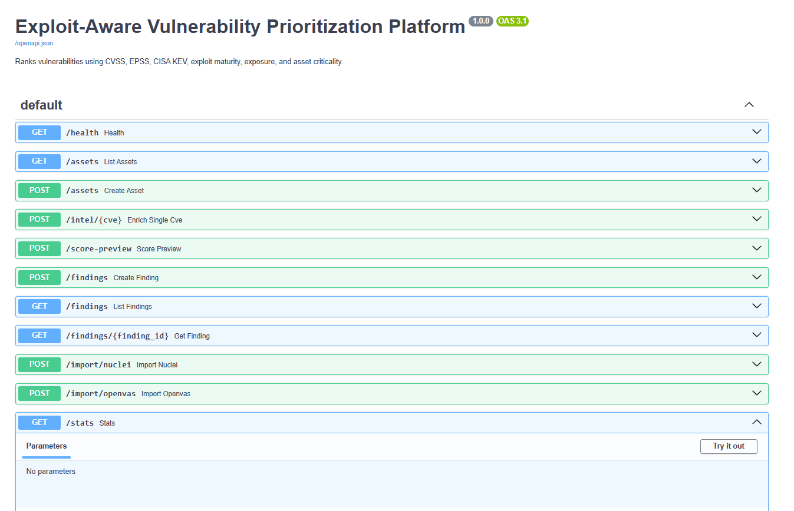
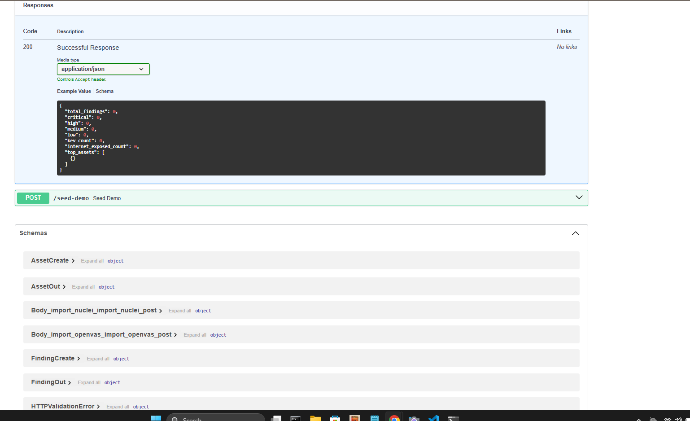
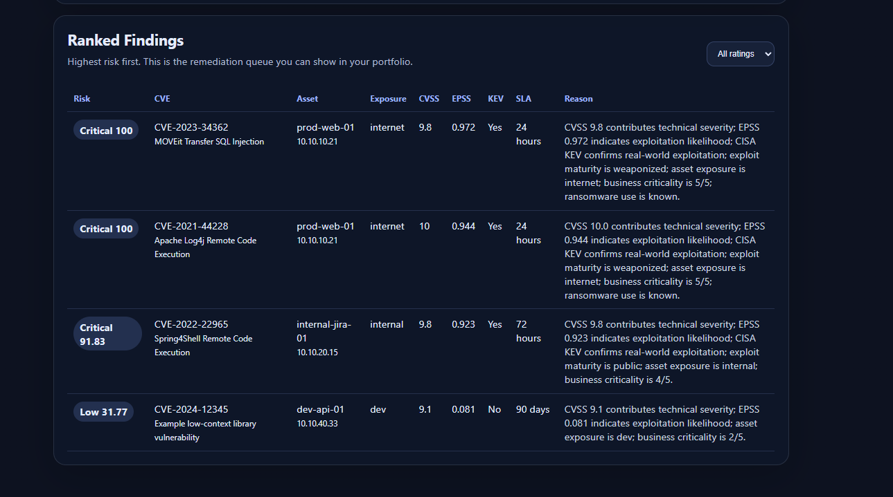

# Exploit-Aware Vulnerability Prioritization Platform

A portfolio-ready SOC / Vulnerability Management project that ranks vulnerabilities using **CVSS + EPSS + CISA KEV + exploit maturity + asset exposure + business criticality**.

This is more realistic than basic vulnerability scanning because real SOC and vulnerability-management teams do not patch only by CVSS. They prioritize based on exploitability, active exploitation, exposure, and business impact.

---

## Features

- FastAPI backend with Swagger documentation
- SQLite by default, PostgreSQL through Docker Compose
- Asset inventory with exposure and business criticality
- Finding ingestion from:
  - Nuclei JSONL
  - OpenVAS / GVM CSV
- Threat-intelligence enrichment from:
  - FIRST EPSS public API
  - CISA Known Exploited Vulnerabilities catalog
- Explainable risk scoring model
- Remediation SLA recommendation
- Simple dashboard frontend
- Offline sample scanner findings for interviews
- Sample scanner files included


---

## Screenshots

### FastAPI backend



### Dashboard overview



### Ranked remediation queue



---

## Project Structure

```text
exploit-aware-vuln-prioritizer/
├── backend/
│   ├── app/
│   │   ├── main.py          # FastAPI routes
│   │   ├── models.py        # SQLAlchemy database models
│   │   ├── schemas.py       # Pydantic schemas
│   │   ├── scoring.py       # Risk scoring engine
│   │   ├── enrichment.py    # EPSS + CISA KEV enrichment
│   │   ├── importers.py     # Nuclei/OpenVAS parsers
│   │   └── database.py
│   ├── requirements.txt
│   └── Dockerfile
├── frontend/
│   ├── index.html
│   ├── styles.css
│   └── app.js
├── data/
│   ├── sample_nuclei.jsonl
│   └── sample_openvas.csv
├── docs/
│   ├── architecture.md
│   └── interview_explanation.md
├── tests/
│   └── test_scoring.py
├── scripts/
│   ├── run_local.sh
│   └── run_local.ps1
├── docker-compose.yml
├── .env.example
└── README.md
```

---

## Option 1: Run Locally Without Docker

### Windows PowerShell

```powershell
cd exploit-aware-vuln-prioritizer
copy .env.example backend\.env
.\scripts\run_local.ps1
```

### Linux / macOS

```bash
cd exploit-aware-vuln-prioritizer
cp .env.example backend/.env
./scripts/run_local.sh
```

Open:

```text
http://localhost:8000/docs
```

Seed sample scanner findings:

```text
POST http://localhost:8000/seed-sample-data
```

Or from Swagger UI, open `/docs` and run the `POST /seed-sample-data` endpoint.

---

## Option 2: Run With Docker Compose

```bash
cd exploit-aware-vuln-prioritizer
docker compose up --build
```

Open:

```text
Backend API: http://localhost:8000/docs
Frontend:    http://localhost:8080
```

Click **Load Sample Scanner Findings** on the dashboard.

---

## API Endpoints

| Method | Endpoint | Purpose |
| --- | --- | --- |
| GET | `/health` | Health check |
| POST | `/assets` | Create asset |
| GET | `/assets` | List assets |
| POST | `/intel/{cve}` | Live enrich one CVE with EPSS + KEV |
| POST | `/findings` | Create a manual finding |
| GET | `/findings` | List ranked findings |
| GET | `/findings/{id}` | View finding details |
| POST | `/import/nuclei` | Import Nuclei JSONL |
| POST | `/import/openvas` | Import OpenVAS CSV |
| POST | `/score-preview` | Test scoring logic |
| GET | `/stats` | Dashboard metrics |
| POST | `/seed-sample-data` | Load offline sample scanner findings |

---

## Example Project Walkthrough

1. Start the API.
2. Open `http://localhost:8000/docs`.
3. Run `POST /seed-sample-data`.
4. Run `GET /findings`.
5. Show that the platform ranks findings by real-world exploit risk, not only CVSS.
6. Open the dashboard at `http://localhost:8080` if using Docker Compose.

---

## Importing Nuclei Output

Run Nuclei in JSONL mode on authorized systems only:

```bash
nuclei -l authorized_targets.txt -jsonl -o nuclei_results.jsonl
```

Import the file through Swagger UI:

```text
POST /import/nuclei
```

The included sample file is:

```text
data/sample_nuclei.jsonl
```

---

## Importing OpenVAS / GVM Output

Export results from OpenVAS/GVM as CSV and import through:

```text
POST /import/openvas
```

The included sample file is:

```text
data/sample_openvas.csv
```

---

## Risk Scoring Model

The scoring model is intentionally explainable.

| Signal | Weight | Meaning |
| --- | ---: | --- |
| CVSS | 25% | Technical vulnerability severity |
| EPSS | 25% | Probability of exploitation |
| CISA KEV | 20% | Confirmed exploitation in the wild |
| Exposure | 15% | Internet/DMZ/internal/dev context |
| Asset Criticality | 10% | Business importance of the asset |
| Exploit Maturity | 5% | None, PoC, public, or weaponized exploit |

Additional modifiers are added for:

- Known ransomware usage
- KEV vulnerability on an exposed asset
- Very high EPSS with high CVSS

---

## Why This Is Better Than Basic Vulnerability Scanning

A normal scanner might say:

```text
CVE A = CVSS 9.8
CVE B = CVSS 9.1
```

This platform says:

```text
CVE A is internet-facing, in CISA KEV, has high EPSS, and has weaponized exploit activity: fix in 24 hours.
CVE B has high CVSS, but low EPSS, no KEV, no exploit, and exists only on a dev asset: schedule normally.
```

That is the difference between vulnerability detection and vulnerability prioritization.

---

## Security Notes

- This project does not exploit systems.
- It does not include offensive exploit code.
- It is intended for authorized vulnerability-management workflows.
- Scanner imports should only come from systems you own or are authorized to assess.

---

## How to Explain This Project on a Resume

**Exploit-Aware Vulnerability Prioritization Platform**  
Built a FastAPI-based vulnerability prioritization platform that ingests OpenVAS and Nuclei scanner outputs, enriches CVEs with EPSS and CISA KEV intelligence, and calculates an explainable remediation priority score using CVSS, exploit maturity, asset exposure, and business criticality. Developed a dashboard and API to rank findings, assign remediation SLAs, and reduce CVSS-only prioritization noise.

---

## Future Improvements

- Authentication and role-based access control
- Scheduled background enrichment
- Jira / ServiceNow ticket creation
- Slack alerting for newly added KEV vulnerabilities
- CMDB integration
- Historical trend charts
- SLA breach tracking
- Container image scanner import support
- SBOM import support

## Windows / Python 3.13 Note

For local Windows execution, this project uses plain `uvicorn` instead of `uvicorn[standard]` to avoid native build dependencies such as `httptools` and `watchfiles`. If you previously created a broken virtual environment, delete `backend/.venv` and run `scripts/run_local.ps1` again.
